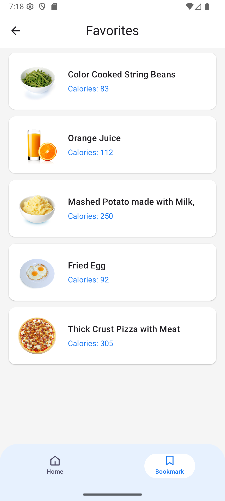
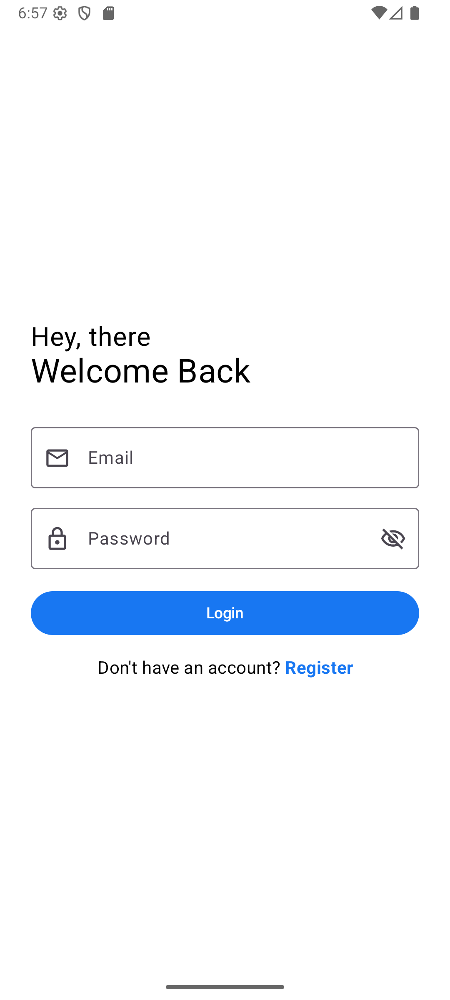
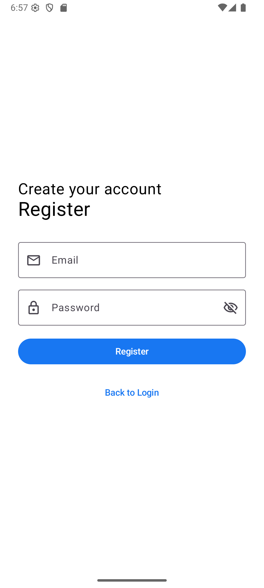
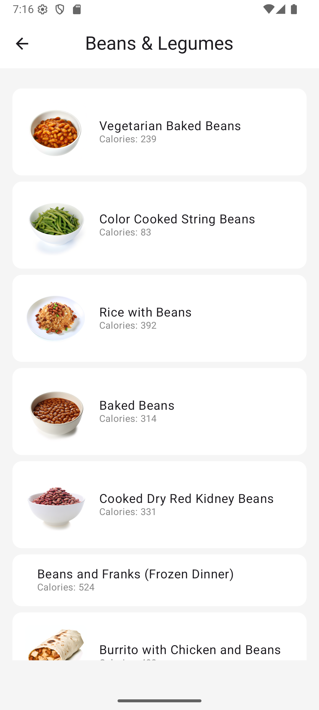
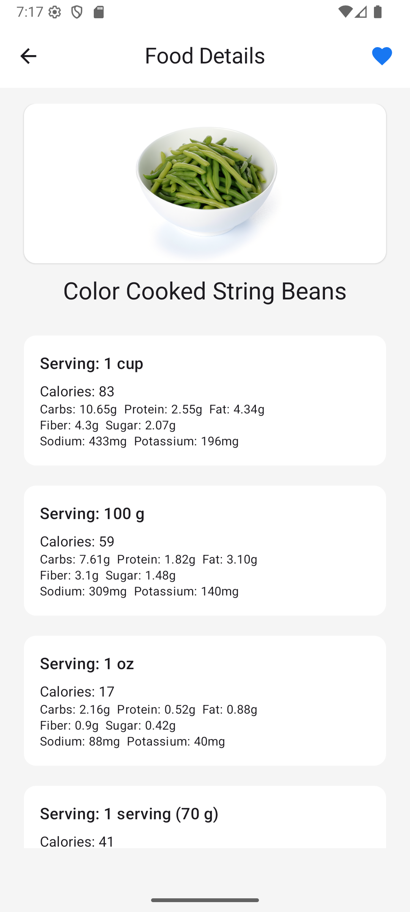
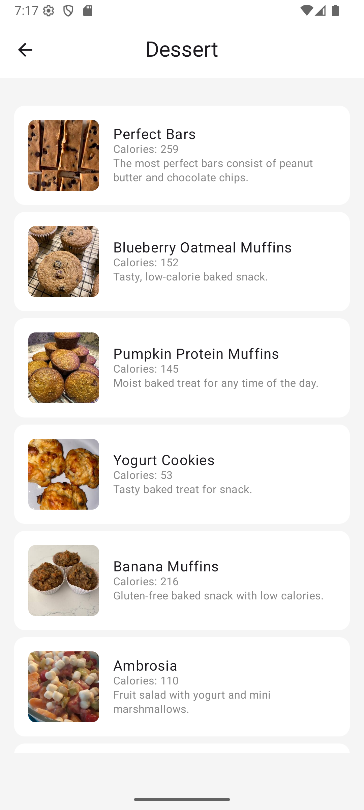
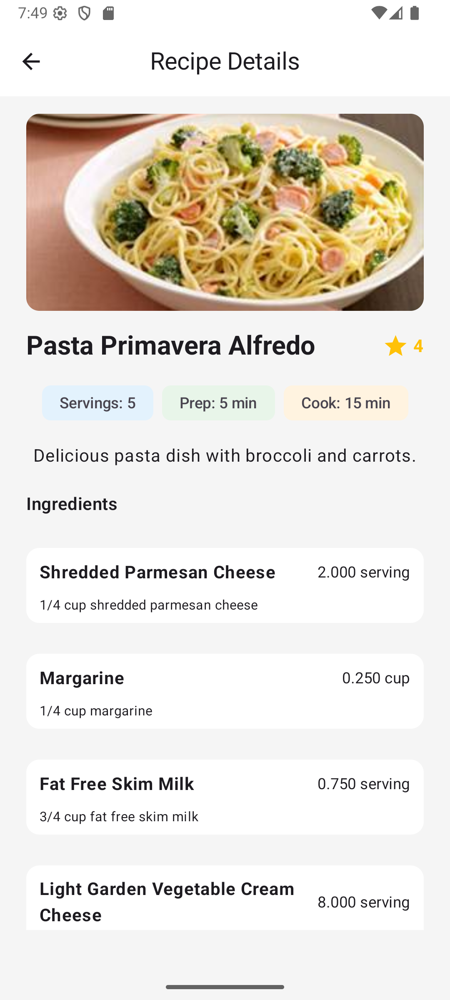

# NutritionApp

> App de nutrición desarrollada en una semana, publicada como demostración técnica y exploración de arquitectura y tecnologias modernas.

---

## 🚀 Características principales

- **Onboarding** guiado en tres pantallas (pantalla 1, 2, 3)
- **Inicio (Home)**: listas de recetas y alimentos
- **Favoritos**
- **Registro / Login** con **Firebase Authentication**
- **Lista de alimentos** con calory tracking
- **Detalles del alimento**: información nutricional (macros, micronutrientes)
- **Lista de recetas** y **detalles de receta**

---

## 🧱 Arquitectura & Tecnologías

- **MVVM + Clean Architecture**: separación clara en capas (presentación, dominio, datos).
- **Jetpack Compose**: UI declarativa moderna para pantallas y listas.
- **Room**: base de datos local para favoritos y almacenamiento offline.
- **Firebase Authentication**: registro e inicio de sesión.
- **Firebase Analytics**: La app registra eventos personalizados para identificar las recetas más buscadas, los alimentos más consultados y las pantallas más visitadas.
- **Hilt**: inyección de dependencias para ViewModels, repositorios y data sources.
- **Kotlin Coroutines + Flow**: para operaciones asíncronas y reactividad.
- **Retrofit**: para obtener información de una API externa nutricional y recetas.

---

## 📸 Capturas de pantalla

<table>
  <tr>
    <td align="center">
      <strong>Onboarding 1</strong> 
       
      Introducción a la app
    </td>
    <td align="center">
      <strong>Onboarding 2</strong> 
       
      Beneficios principales
    </td>
    <td align="center">
      <strong>Onboarding 3</strong> 
       
      Comienza a explorar
    </td>
  </tr>
  <tr>
    <td align="center">
      <strong>Home</strong> 
       
      Vista principal de recetas
    </td>
    <td align="center">
      <strong>Favoritos</strong> 
       
      Recetas y alimentos guardados
    </td>
    <td align="center">
      <strong>Inicio de sesión</strong> 
       
      Inicio de sesión con Firebase
    </td>
  </tr>
  <tr>
    <td align="center">
      <strong>Registro</strong> 
       
      Crear una nueva cuenta
    </td>
    <td align="center">
      <strong>Lista de Alimentos</strong> 
       
      Buscar alimentos y ver calorías
    </td>
    <td align="center">
      <strong>Detalles de Alimento</strong> 
       
      Información nutricional completa
    </td>
  </tr>
  <tr>
    <td align="center">
      <strong>Lista de Recetas</strong> 
       
      Explorar recetas saludables
    </td>
    <td align="center">
      <strong>Detalles de Receta</strong> 
       
      Ingredientes e instrucciones
    </td>
    <td></td>
  </tr>
</table>
