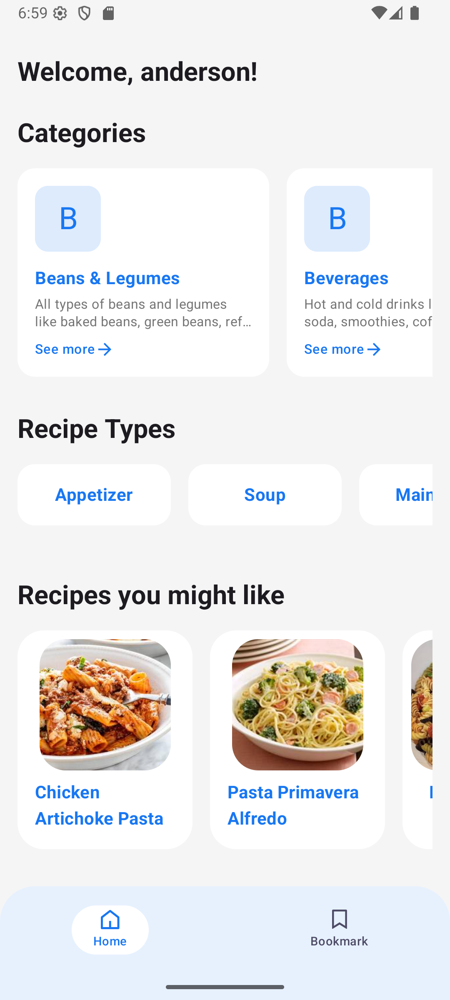
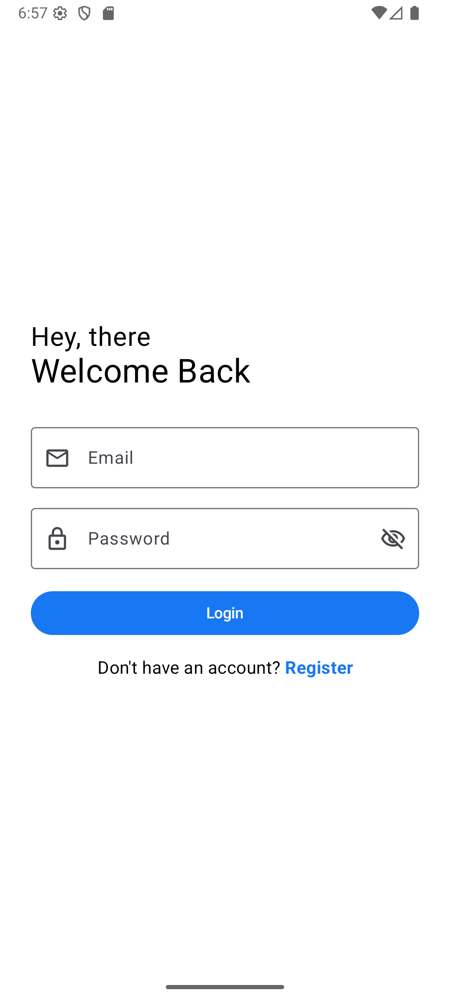
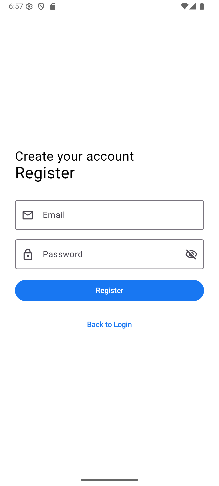

# NutritionApp

> App de nutrici贸n desarrollada en una semana, publicada como demostraci贸n t茅cnica y exploraci贸n de arquitectura y tecnologias modernas.

---

##  Caracter铆sticas principales

- **Onboarding** guiado en tres pantallas (pantalla 1, 2, 3)
- **Inicio (Home)**: listas de recetas y alimentos
- **Favoritos**
- **Registro / Login** con **Firebase Authentication**
- **Lista de alimentos** con calory tracking
- **Detalles del alimento**: informaci贸n nutricional (macros, micronutrientes)
- **Lista de recetas** y **detalles de receta**

---

## П Arquitectura & Tecnolog铆as

- **MVVM + Clean Architecture**: separaci贸n clara en capas (presentaci贸n, dominio, datos).
- **Jetpack Compose**: UI declarativa moderna para pantallas y listas.
- **Room**: base de datos local para favoritos y almacenamiento offline.
- **Firebase Authentication**: registro e inicio de sesi贸n.
- **Firebase Analytics**: La app registra eventos personalizados para identificar las recetas m谩s buscadas, los alimentos m谩s consultados y las pantallas m谩s visitadas.
- **Hilt**: inyecci贸n de dependencias para ViewModels, repositorios y data sources.
- **Kotlin Coroutines + Flow**: para operaciones as铆ncronas y reactividad.
- **Retrofit**: para obtener informaci贸n de una API externa nutricional y recetas.

---

##  Capturas de pantalla

| Pantalla | Descripci贸n |
|----------|-------------|
| Onboarding 1 | Introducci贸n a la app |
| Onboarding 2 | Beneficios principales |
| Onboarding 3 | Empec茅 a usar |
| Home | Vista principal con recetas y alimentos |
| Favorites | Lista de favoritos guardados |
| Login / Register | Pantallas de autenticaci贸n |
| Food List | Buscar alimentos para calor铆as |
| Food Details | Informaci贸n detallada del alimento |
| Recipe List / Details | Recetas disponibles y su informaci贸n |

```markdown
  
  
  
  
  
  
  
  
  
  
  
